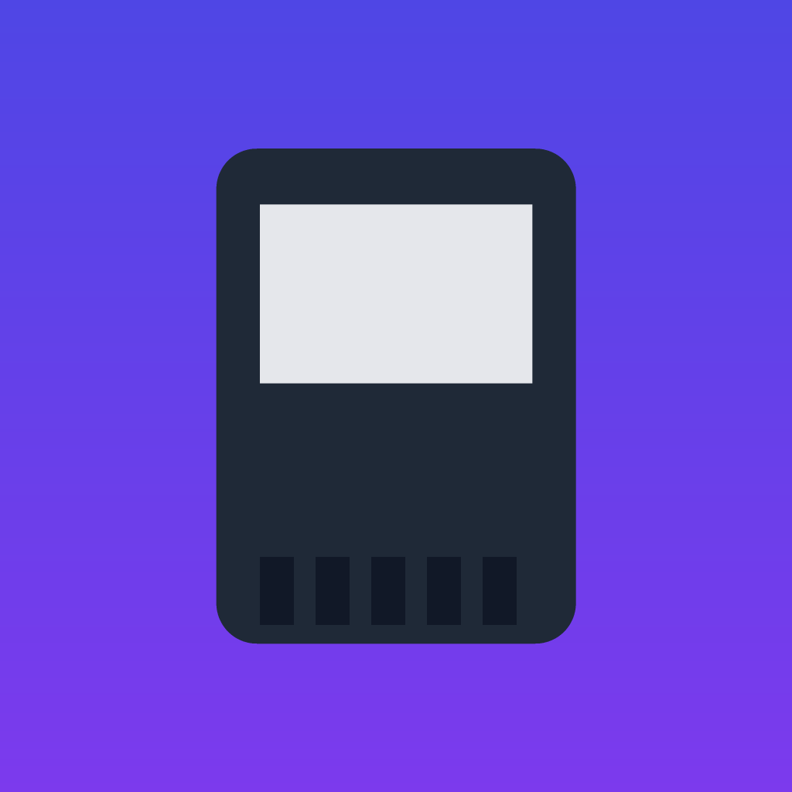
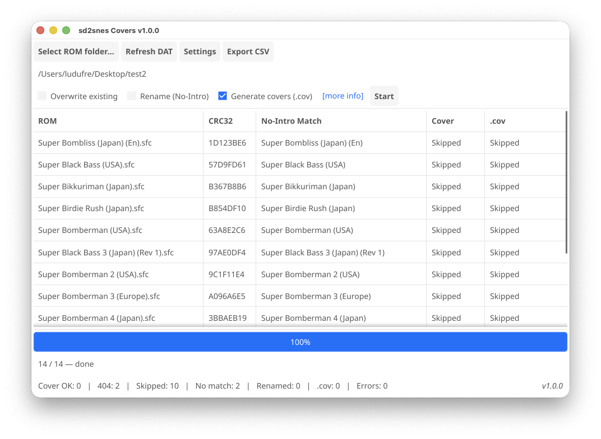

<div align="center">



# sd2snes Covers

**Desktop app (Windows · macOS · Linux) that generates `.cov` cover files for [the sd2snes+ firmware fork](https://github.com/ludufre/sd2snes).**

Point it at a folder of Super Nintendo ROMs: it identifies each game by its CRC32, downloads the official box art from libretro, and converts it into the `.cov` format the firmware shows in its menu — all in one click. It can also rename ROMs to their No-Intro name and export a CSV.

</div>

---

> [!WARNING]
> **This desktop app is discontinued — `v1.4.2` is the final release.** Everything it did (and more) now runs in the browser-based **[sd2snes+ Web Manager](https://sd2snes.ludufre.com/manager)** — nothing to install. It downloads `.cov` covers, game info, and cheats automatically, identifies every game by CRC32, previews the in-game screen with sound, organizes the SD card, and updates the sd2snes+ firmware, all pulling from the community GameDB while your files never leave your computer.

> **What is this for?** The [sd2snes+](https://github.com/ludufre/sd2snes) firmware fork can display a game's cover in the file browser. This tool prepares those covers (`<rom>.cov`, next to each ROM) so you just copy them to the SD card. Downloading the box art and matching by CRC32 are the means; **the `.cov` files are the goal.**

> [!IMPORTANT]
> **Version 1.1.0 changed the cover format and is not backward-compatible.**
> - `.cov` files now use the **OBJ-sprite format**; covers generated by earlier versions **not** display correctly — **regenerate them with 1.1.0 or newer**.
> - The new covers require the **sd2snes+ firmware `v1.11.2-br-2.1` or newer**. On older firmware they won't show up.


## ✨ Features

| Feature | Description |
|---|---|
| 🧩 **Generate `.cov`** ⭐ | Downloads and converts each cover into the firmware's `.cov` (OBJ-sprite cover) format, saved as `<rom>.cov` next to the ROM (SNES/SFC/GB/SGB) — **the main goal.** |
| ⚡ **Just convert to `.cov`** | Have your own art already? Point it at a folder of images and convert each one straight to a `.cov` next to it (`cover.png` → `cover.cov`) — no CRC32, no DAT, no download. Accepts **PNG / JPG / BMP**. |
| 🔎 **Recursive scan** | Finds every `.sfc` / `.smc` / `.gb` / `.gbc` / `.sgb` in a folder and its subfolders. |
| 🧮 **Match by CRC32** | Identifies each game by its *headerless* CRC32 against the libretro No-Intro DAT (4256 ROMs). |
| 🖼️ **Box art download** | Fetches the official `.png` from `thumbnails.libretro.com` (the source image for the `.cov`), saved next to the ROM. |
| 🎮 **Download cheats** | Fetches each game's cheat file by CRC32 from `sd2snes.ludufre.com/cheats/<CRC32>.yml` into a `sd2snes/cheats/` folder at the root of the chosen folder, named after the ROM (`<rom>.yml`). On a name clash between two different games it reports **Collision** and keeps the first file. |
| ✏️ **Rename (No-Intro)** | Renames the ROM to its canonical No-Intro name (carrying the cover/`.cov` along). |
| 📄 **Export CSV** | A spreadsheet with the result for each ROM. |
| ⚙️ **Cross-platform** | Single binary per OS (Go + [Fyne](https://fyne.io)), no external runtime. |



## 🚀 Usage

1. **Select ROM folder** — pick the folder (subfolders are scanned too).
2. Toggle the options you want: **Overwrite existing**, **Rename (No-Intro)**, **Generate .cov** (on by default), **Download cheats** (on by default — saves `<rom>.yml` into a `sd2snes/cheats/` folder).
3. **Start** — watch the progress bar and the per-ROM status in the table.
4. (Optional) **Export CSV** with the results — it includes each game's **boxart URL** (handy for the ones reported as *Not found*) and opens with the right columns in Excel/LibreOffice. Click any table cell to copy its full text to the clipboard.

The No-Intro DAT is downloaded once and cached; **Refresh DAT** forces a re-download. Downloaded box art is also cached between runs (so re-runs and duplicate ROMs don't re-download); **Settings → Clear cover cache** empties it. When **Generate .cov** is off, the cached PNG is copied next to the ROM instead. Use **Settings** to change the No-Intro DAT URL or the cover repository URL (saved across runs). A link to the [sd2snes+ firmware](https://github.com/ludufre/sd2snes) sits at the bottom of the window.

Per-ROM status: **OK** · **Not found** (in the DAT, but no cover on the server) · **Skipped** (file already exists) · **No match** (CRC not in the DAT) · **Error** (network/IO). The **Cheats** column adds **Collision** (two different games would share one output filename — the first wins, the file is not overwritten). Cheats are fetched purely by CRC32, independent of the box-art DAT match. All columns are included in the exported CSV.

### Already have your own art? — Just convert to `.cov`

Click **Just convert to .cov**, pick a folder of images, and every **PNG / JPG / BMP** in it (subfolders included) is converted straight to a `.cov` next to it (`cover.png` → `cover.cov`). No CRC32, no DAT, no download — it just runs the image through the same `.cov` encoder. **Overwrite existing** is honored (existing `.cov` files are skipped when it's off).

## 📦 Install

Download the artifact for your OS from the [Releases](../../releases) page:

- **Windows** — `sd2snes-covers-windows-amd64.exe` (if it doesn't open, see [the note below](#windows--app-doesnt-open-no-window))
- **Windows (software OpenGL)** — `sd2snes-covers-windows-amd64-softgl.zip`, for machines with no GPU OpenGL driver (see [the note below](#windows--app-doesnt-open-no-window))
- **macOS** — `sd2snes-covers-macos-universal.zip` (Apple Silicon + Intel; see the Gatekeeper note below)
- **Linux** — `sd2snes-covers-x86_64.AppImage` (`chmod +x` and run)

### macOS — Gatekeeper

Unsigned binaries trigger Gatekeeper on first launch:

- Right-click the app → **Open** → **Open**; **or**
- `xattr -dr com.apple.quarantine "sd2snes Covers.app"`

To ship without that prompt, sign + notarize with an Apple Developer ID:

```sh
export APPLE_ID="you@example.com"
export APPLE_APP_SPECIFIC_PASSWORD="xxxx-xxxx-xxxx-xxxx"  # appleid.apple.com
export APPLE_TEAM_ID="XXXXXXXXXX"
NOTARIZE=1 ./build.sh mac        # fyne package → codesign → notarytool → staple
```

Requires a *Developer ID Application* certificate in your keychain; the steps live in `packaging/macos/notarize.sh`.

### Windows — app doesn't open (no window)

If the `.exe` shows up in Task Manager but **no window ever appears** — or the window **flashes and closes immediately** — your machine can't use a hardware OpenGL driver (Fyne needs OpenGL 2.1+). This happens when the display adapter is **"Microsoft Basic Render Driver"** (no GPU driver installed), and on **Remote Desktop**, **virtual machines** without 3D acceleration, and **old/driverless GPUs**.

Fix: download **`sd2snes-covers-windows-amd64-softgl.zip`** from [Releases](../../releases), extract both files (`sd2snes Covers.exe` + `opengl32.dll`) into the same folder, and just run the `.exe`. That bundled `opengl32.dll` is a software OpenGL renderer ([Mesa3D / llvmpipe](https://fdossena.com/?p=mesa/index.frag)) that Windows loads automatically because it sits next to the program — no launcher, no settings. Keep the two files together. If your machine actually has a GPU, the cleaner fix is to install its driver and use the normal `.exe` instead.

> To capture the exact error, a maintainer can build a console variant with `DEBUG_CONSOLE=1 bash packaging/windows/build-exe.sh` and run it from `cmd.exe`.

## 🛠️ Build from source

Requires [Go 1.24+](https://go.dev/dl/). Fyne uses CGO + OpenGL, so each OS needs its own C compiler.

### Run in development

```sh
go run .
```

### Produce the artifacts (quick way, from macOS)

```sh
./prepare.sh      # installs Go, fyne, mingw-w64 and checks Docker (once)
./build.sh        # builds .app + .exe + .AppImage into dist/
```

`./build.sh` accepts targets (`./build.sh mac win linux`) and `SKIP_TESTS=1` to skip `go vet`/`go test`.

### The manual steps behind the build

```sh
go install fyne.io/tools/cmd/fyne@latest

# macOS (.app, native)
fyne package -os darwin

# Windows (.exe, cross-compiled with mingw-w64)
env CGO_ENABLED=1 GOOS=windows GOARCH=amd64 CC=x86_64-w64-mingw32-gcc fyne package -os windows

# Linux (.AppImage) — on Linux: run the script directly; on another OS, via Docker:
docker run --rm --platform linux/amd64 -v "$PWD":/src -w /src \
  golang:1.24-bookworm bash packaging/linux/build-appimage.sh
```

### Release via CI

Pushing a `v*` tag triggers `.github/workflows/release.yml`, which builds all three on native runners (the AppImage on Linux, no emulation) and publishes a GitHub Release:

```sh
git tag v1.0.0 && git push origin v1.0.0
```

## 🔬 How it works (technical notes)

- **Headerless CRC32** — SNES ROMs may carry a 512-byte copier header. It is detected by size (`size % 1024 == 512`) and skipped before the CRC32 (IEEE polynomial), because No-Intro checksums are computed without the header.
- **Box art name** — uses the No-Intro game name, replacing `` & * / : ` < > ? \ | " `` with `_` (libretro's filename rule) and then URL-encoding it.
- **Rename without leftovers** — when a ROM is renamed, its old-named `.png`/`.cov` siblings are carried to the new name; it never overwrites a different existing file.
- **`.cov` format** — a 12-byte header + up to 8 BGR555 OBJ palettes + a per-16×16-block palette map (the BLOCKMAP) + 4bpp planar tiles in OBJ name-grid order. The firmware draws the cover with **16×16 OBJ sprites floating over the file list** (so the list keeps its full Mode-5 hi-res rows): a fixed **8×6 grid (128×96 px)**, 4bpp, with one of 8 palettes assigned per 16×16 block. Letterbox-fit (keeps proportion, whole box) with cross-block Floyd-Steinberg dithering. This format requires **sd2snes+ firmware `v1.11.2-br-2.1` or newer** and replaces tile-based covers from earlier app versions (not interchangeable).

## 🗂️ Project layout

```
main.go                       Entry point (Fyne app + window)
internal/snes/                Headerless CRC32
internal/scan/                Recursive .sfc/.smc discovery
internal/dat/                 DAT download/cache + clrmamepro parser
internal/thumbs/              Box art URL + download
internal/cheats/              Cheat (.yml) URL + download by CRC32
internal/cov/                 .cov encoder/decoder
internal/pipeline/            Worker pool, rename, .cov, CSV, progress
internal/ui/                  Fyne interface
packaging/linux/              AppImage build (script + AppRun + .desktop + hicolor icons)
packaging/icons/              Per-platform icons (square/macOS .png, .ico, .icns)
packaging/genicons/           Regenerate every icon from packaging/icon-big.png
prepare.sh · build.sh         Environment setup and artifact builds
```

## ✅ Tests

```sh
go test ./...            # unit (offline)
go test ./... -run E2E   # includes end-to-end tests that download for real
```

They cover: header/CRC32 detection, the DAT parser, box art sanitization/URL, `.cov` encode/decode (4bpp planar round-trip, header, validation) and the full pipeline (match → cover → rename → `.cov`).

## 🙏 Credits

- Database and thumbnails: [libretro-database](https://github.com/libretro/libretro-database) / [No-Intro](https://no-intro.org/).
- GUI: [Fyne](https://fyne.io/).
- `.cov` format & target firmware: the [ludufre/sd2snes](https://github.com/ludufre/sd2snes) fork (`utils/cover_conv.py` / `src/cover.c`).
